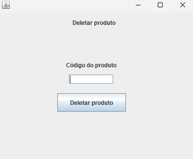

# Sistema Cadastro Produtos

## Funcionalidades

- Cadastro de produtos
- Atualização de informações de produtos
- Deleção de produtos
- Visualização de todos os produtos cadastrados

## Telas do Sistema

### Tela Inicial
Esta é a tela inicial do sistema, onde o usuário pode acessar todas as funcionalidades principais.

 

---

### Tela de Cadastro de Produto
Nesta tela, o usuário pode cadastrar novos produtos.

 

---

### Tela de Atualização de Produto
Permite que o usuário atualize as informações de um produto já cadastrado no sistema.

 

---

### Tela de Deleção de Produto
O usuário pode deletar um produto cadastrado no sistema.

 

---

### Tela de Visualização de Produtos
Aqui, o usuário pode visualizar todos os produtos cadastrados.

 

---
